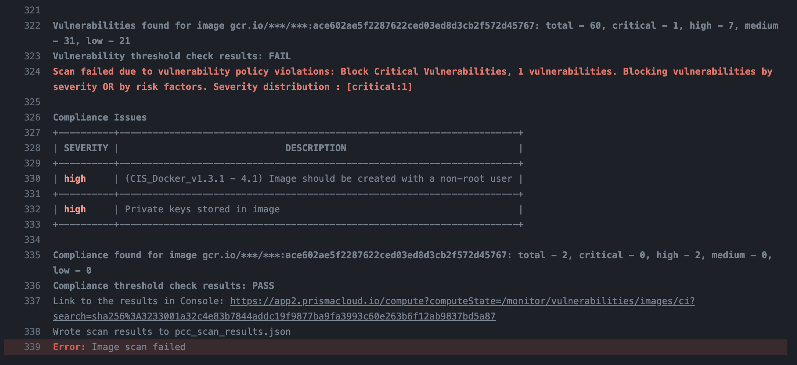

Complete CNAPP demo using Prisma Cloud demonstrating Cloud Code Security, Cloud Workload Protection (Agent, Agentless, Web Application and API Security) , Cloud Infrastructure Entitlement Management, Cloud Data Security, Cloud Security Posture Management . Demonstrates how the platform adds value to different persona's starting from developers to executives.
Uses Github actions for CI and CD process.
## Intent:
 Demo intent is to showcase Prisma Cloud Capabilities across
  - Multiple clouds. (EKS,GKE,AKS)
  - Multiple form factors. (Container, Host, Serverless, Google Run)
  - Different phases of application lifecycle.
  - Multiple teams.
  - Processes which are already part of organizational day to day activities.

AND you have a copy-paste coder like Sandeep in your team :)    
Also want to showcase how not following best practices at dev/devops level might have increased blast radius.

## Installation:
 - Terraform templates are provided in IaC folder. These are for reference only. Please modify as per your requirements.
 - Yaml files for K8s deployment are provided in root folder
 - Github action files can be found in .github folder and secrets configured can be found [here](https://github.com/chanduusc/prismacloud-demo/IaC/README.md#secrets)
## Code Security:
### Coding phase (Persona: Developer/Devops)
1. Install Checkov plugin for VSCode (or IntelliJ) 
2. Copy copy_to_req file to requirements.txt
3. The developer/devops will be notified of misconfigurations/vulnerabilites within IDE while coding.

> Example files for terraform,yaml,secrets can be found in fake_commits folder. Please use as per your requirement.
### Review/CI phase (Persona: Dev/Devops Leads/Managers)
1. Integrate your Github repo with Primsa Cloud Code Security module.
2. Push the code to your branch and raise pull request
3. The reviewers will be notified of misconfigurations/vulnerabilites in review process.This makes reviewers aware of the security issues in addition to coding issues.
4. Code-checkins are gated by security as PC scan becomes one of the checks during CI process

### Review/CI phase (Persona: Security Team)
1. Security team can see the same failures in Prisma Cloud console.
2. Security team can submit fixes from Prisma Cloud console which will open a new PR against your repo.
3. Prisma bot will mark the comments outdated once fixed.

__**Please pay attention to docker file where apt is used against best practices**__

## Cloud Workload Protection:
__**Vulnerability policies are used as example here. Can be used with compliance policies too**__
### CD phase (Persona: Developer/Devops)
1. Github actions trigger build and deploy jobs in EKS,GKE and AKS.
2. Prisma Cloud image scan is inserted as part of github actions.
3. Policies for vulnerabilites (or compliance) can be set from Prisma Cloud.
4. Prisma Cloud will scan the image and fail the CD job hence the non-approved images are not pushed to registries.

### CD phase (Persona: Security Team)
1. Sets the polices related to images being built on day to day basis within the tools/process which are already part of organization.
2. Can view the real time status of builds in Prisma Cloud console.
3. Can debug/know which layer of build introduced the vulnerabilities.

### Image storage in registry (Persona: Security Team)
1. Image scanning is important after image build and push to registry
2. Vulnerabilites present in the image might be discovered after the image is built.
3. The same applies to deployed images.

### Deploy Security (Persona: Devops)
1. Devops team can see the vulnerable images not getting deployed.
2. The reason of failure (policy) can be viewed in audit logs

### Deploy Security (Persona: Security Team)
1. Security team can set policies around deployment. Advanced features/exceptions can also be configured.
2. A message can be set so deployment team can know the reason/next steps.
3. Deployment failures are logged in PC Events tab.

__**Notice that the message set in Prisma Cloud console is visible in k8s audit logs**__
# Work in progress

